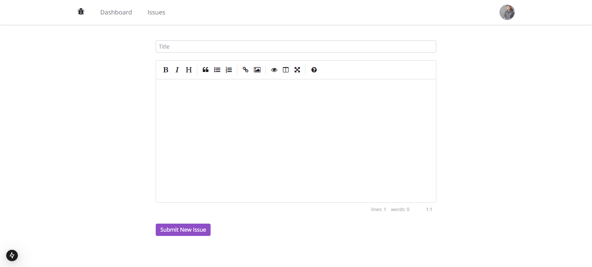

# Issue Tracker

This is a simple issue tracker application built with Next.js and Prisma. It allows users to log in, create, read,
update, and delete issues, assign issues to users, filter issues by status, and paginate issues. The application uses
Zod for data validation, Radix UI for components, React Query for data fetching and caching with authentication.

## Features

* Login and logout
* Create, read, update and delete issues
* Assign issues to users
* Filter issues by status
* Paginate issues
* Data validation using Zod and React Hook Form

## Screenshots

## Technologies Used

* Next.js (React framework)
* Prisma (ORM)
* Radix UI (Component library)
* React Query (Data fetching and caching library)
* Next-Auth (Authentication library)
* Google OAuth (Authentication provider)
* Zod (Validation library)
* React Hook Form (Form library)

## Installation

1. Clone the repository: `git clone https://github.com/omar-dulaimi/issue-tracker.git`
2. Create the environment file by running `cp .env.example .env` and fill in the following values:
    * `DATABASE_URL=""` - your database connection string
    * `NEXTAUTH_URL="http://localhost:3000"` - the URL of your Next.js app
    * `NEXTAUTH_SECRET=""` - a secret key for NextAuth
    * `GOOGLE_CLIENT_ID=""` - your Google OAuth client ID
    * `GOOGLE_CLIENT_SECRET=""` - your Google OAuth client secret
3. Create the database schema by running `prisma migrate dev`
4. Install dependencies: `yarn install`
5. Run the development server: `yarn dev`

## License

This project is licensed under the MIT License. See the [LICENSE](LICENSE) file for details.